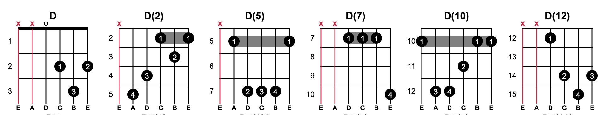
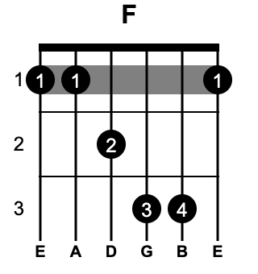
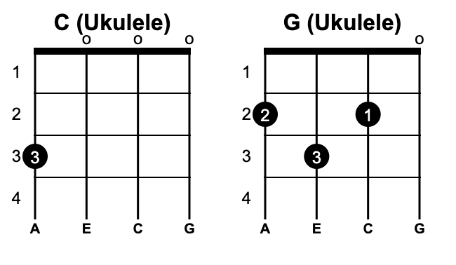
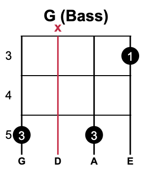

# Guitar Chord Web Component


A simple, dependency-free web component to display guitar chord diagrams as SVG images.

It comes with a built-in library of over 2600 chords for the standard 6-string guitar (classical/acoustic) and allows for easy definition of custom chords and color schemes. Because it's a standard web component, it can be used in any HTML page or with any JavaScript framework.

```html
<guitar-chord name="C"></guitar-chord>
<guitar-chord name="Am"></guitar-chord>
<guitar-chord value="o|1-2|2-3|2-4|o|x" name="Am (custom)"></guitar-chord>
```

### Built-in guitar chords source
The built-in guitar chords use data from the [Guitar Chords finger positions Data Set](https://www.kaggle.com/datasets/aartiravariya/chordfingerscsv) which was automatically converted to the component's required format.
As the fact - this dataset was originally created for a guitar learning software project (https://www.fachords.com)


## Installation

1.  Download the `guitar-chord.js` file.
2.  Include it in your HTML file using a `<script>` tag.

```html
<script type="module" src="/path/to/guitar-chord.js"></script>
```

## Usage

Once the script is included, you can use the `<guitar-chord>` custom element anywhere in your HTML body.

### Attributes

The component is configured through HTML attributes.

#### Chord Definition

| Attribute           | Type    | Description                                                                                                                                                                                                                                                                                                                                               |
|---------------------|---------|-----------------------------------------------------------------------------------------------------------------------------------------------------------------------------------------------------------------------------------------------------------------------------------------------------------------------------------------------------------|
| `name`              | string  | **(Mandatory)** The name of the chord to display from the built-in library (e.g., "C", "Am", "G7"). Or a custom chord name if the `value` attribute is present.                                                                                                                                                                                           |
| `value`             | string  | **(Conditional)** A pipe-separated string that defines a custom chord. If this attribute is present, it takes precedence over `name`. The format is `s1\|s2\|s3\|s4\|s5\|s6`, where `s1` is the 1st (thinnest) string. Each part can be: `x` (muted), `o` (open), a fret number (e.g., `3`), or a fret number with a finger (`fret-finger`, e.g., `3-4`). |
| `open-string-notes` | string  | **(Conditional)** A pipe-separated open string notes. By default - `E\|A\|D\|G\|B\|e` for the standard 6-string guitar (classical/acoustic).                                                                                                                                                                                                              |


#### Visual Customization

| Attribute             | Type   | Default                                                                                       | Description                                          |
|-----------------------| ------ |-----------------------------------------------------------------------------------------------| ---------------------------------------------------- |
| `color`               | string | `#000000`    | The primary color for frets, strings, and finger dots. |
| `background-color`    | string | `#FFFFFF`    | The background color of the chord diagram.           |
| `muted-string-color`  | string | `#D70040`    | The color for muted ("x") strings.                   |


### Built-in Chord Naming

The component includes a library of over 2600 chords. Many chords can be played in different positions (voicings) along the guitar neck. The naming convention helps distinguish between these variations.

*   A plain chord name like `D` usually refers to the most common, open-position voicing.
*   Alternate voicings are indicated by a number in parentheses, like `D[5]`. This number represents the **lowest fret** used in that particular chord shape. If there are several chords of the same fret then adding a version number into parentheses, like `D[2-1]` and `D[2-2]`

For example, the built-in library contains multiple voicings for the D major chord: `D`, `D[2]`, `D[5]`, `D[7]` and `D[10]`.


### Notes

| Alphabetical name | Musical note name |
|-------------------|-------------------|
| `C`               | Do                |
| `D`               | Re                |
| `E`               | Mi                |
| `F`               | Fa                |
| `G`               | So                |
| `A`               | La                |
| `B`/`H`           | Si                |

### Finger numbers


### Examples

#### 1. Display a built-in chord

The simplest use case is to render a chord from the component's internal library by providing a `name`.

```html
<guitar-chord name="G"></guitar-chord>
```


#### 2. Display a custom chord

Use the `value` attribute to define a chord that isn't in the library or to show a specific fingering. This example defines an F major barre chord.

```html
<guitar-chord name="F" value="1-1|1-1|2-2|3-3|3-4|1-1"></guitar-chord>
```


#### 3. Customize colors

You can easily create a "dark mode" version of a chord diagram by setting the color attributes.

```html
<guitar-chord
        name="Cm11"
        color="white"
        background-color="#333"
        muted-string-color="gray"
></guitar-chord>
```


## Adapting for Other Instruments

While designed for guitar, this component is flexible enough to display chords for other stringed instruments like the ukulele, bass, or mandolin.

To do this, you need to:
1.  Use the `value` attribute to define the chord shape with the correct number of strings for the instrument.
2.  (Optional) Use the `open-string-notes` attribute to display the correct open-string tuning for that instrument.

### Ukulele Example

A standard ukulele has 4 strings tuned to G-C-E-A. Here is how you would display a C major chord (`0003`) and a G major chord (`0232`) on a ukulele.

```html
<!-- Ukulele C Major Chord -->
<guitar-chord
  name="C (Ukulele)"
  value="3-3|o|o|o"
  open-string-notes="A|E|C|G"
></guitar-chord>

<!-- Ukulele G Major Chord -->
<guitar-chord
  name="G (Ukulele)"
  value="2-2|3-3|2-1|o"
  open-string-notes="A|E|C|G"
></guitar-chord>
```


### 4-String Bass Example

Here is a G major arpeggio on a 4-string bass guitar (E-A-D-G tuning).

```html
<!-- Bass G Major Arpeggio -->
<guitar-chord
  name="G (Bass)"
  value="5-3|x|5-3|3-1"
  open-string-notes="G|D|A|E"
></guitar-chord>
```
